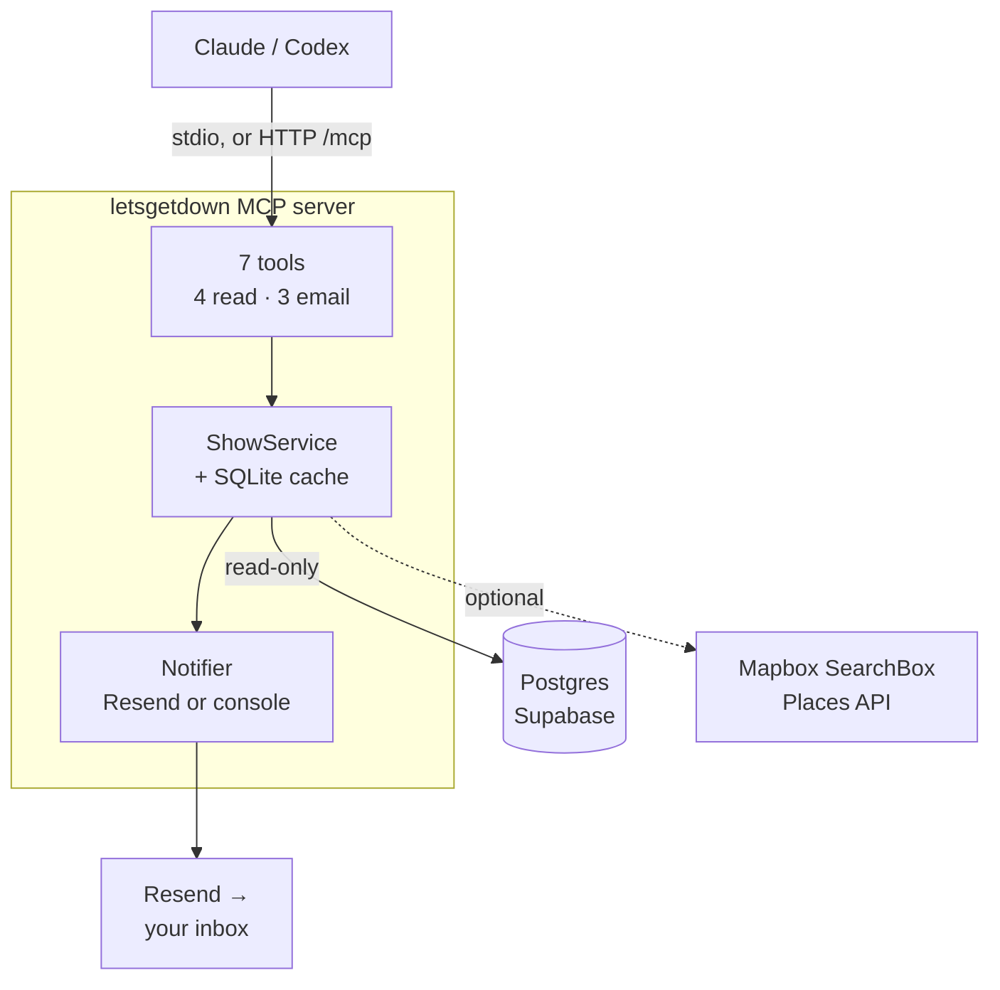

# Let's Get Down MCP — Architecture

- **Transport:** stdio by default. HTTP binds to localhost; a non-local bind requires `MCP_AUTH_TOKEN`.
- **`--http-public`:** only the 4 read tools. Email tools stay local-only until Story 7 adds per-user identity.
- **SQLite:** show cache (12-hour TTL) plus the one saved email per machine.
- **Mapbox SearchBox Places API:** venue neighborhoods for `weekend_neighborhoods`, never cached.
- **Not built yet:** SMS, Klaviyo, ntfy.
