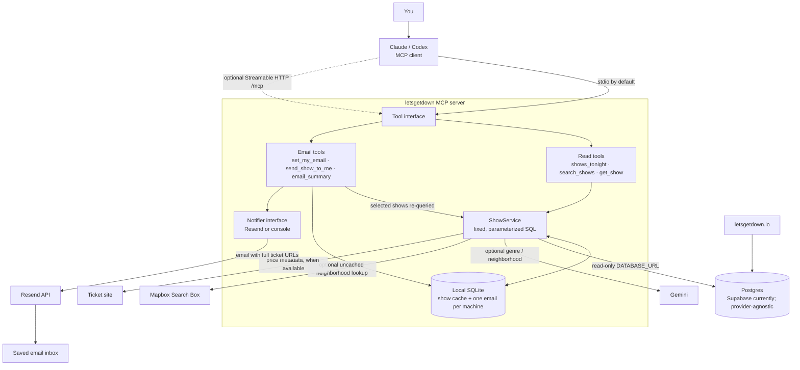

# Let's Get Down MCP — Architecture

The normal local transport is stdio. Streamable HTTP is optional; it binds to localhost by default, and `MCP_AUTH_TOKEN` can require a bearer token. A non-local bind requires that token.

The `--http-public` mode registers only the three show-discovery tools. Personal/email tools remain available over local stdio or localhost HTTP, but non-local HTTP cannot run with those tools. Hosted user identity and private per-user storage are still Story 7 work; this diagram shows the current local email flow.

The SQLite cache defaults to a 12-hour TTL. Mapbox Search Box results are used only in responses, not persisted in the cache. Notification backends are selected with `NOTIFY_BACKENDS`; the implemented adapters are `resend` and `console`. SMS, Klaviyo, and ntfy are not part of the current server.
