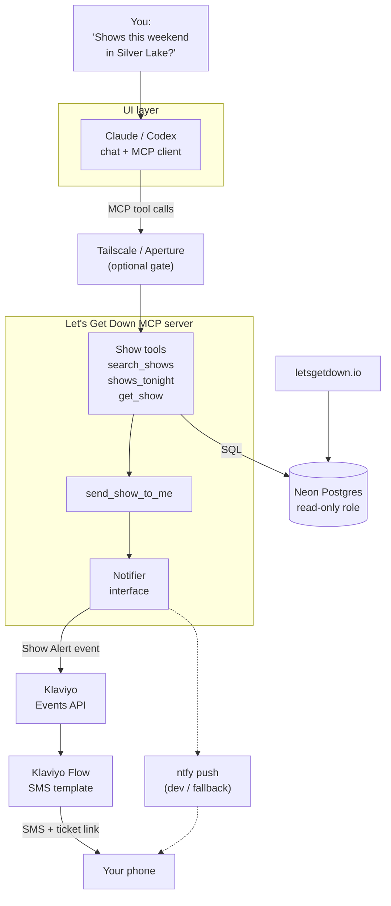

# Let's Get Down MCP — Architecture

```mermaid
flowchart TB
    U["You:<br/>'Shows this weekend<br/>in Silver Lake?'"]

    subgraph UI_LAYER["UI layer"]
        UI["Claude / Codex<br/>chat + MCP client"]
    end

    GW["Tailscale / Aperture<br/>(optional gate)"]

    subgraph MCP_SERVER["Let's Get Down MCP server"]
        MCP["Show tools<br/>search_shows<br/>shows_tonight<br/>get_show"]
        SEND["send_show_to_me"]
        NOTIFY["Notifier<br/>interface"]
        MCP --> SEND --> NOTIFY
    end

    DB[("Neon Postgres<br/>read-only role")]
    WEB["letsgetdown.io"]

    KAPI["Klaviyo<br/>Events API"]
    FLOW["Klaviyo Flow<br/>SMS template"]
    NTFY["ntfy push<br/>(dev / fallback)"]
    PHONE["Your phone"]

    U --> UI
    UI -->|MCP tool calls| GW
    GW --> MCP
    MCP -->|SQL| DB
    WEB --> DB
    NOTIFY -->|Show Alert event| KAPI
    KAPI --> FLOW
    FLOW -->|SMS + ticket link| PHONE
    NOTIFY -.-> NTFY
    NTFY -.-> PHONE
```